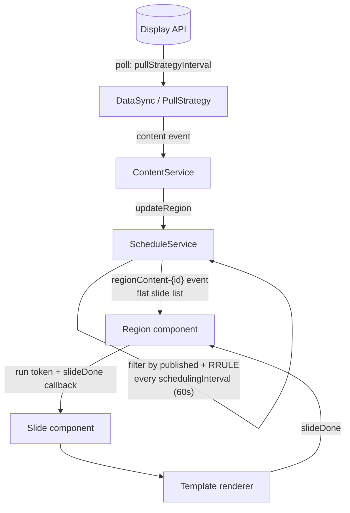
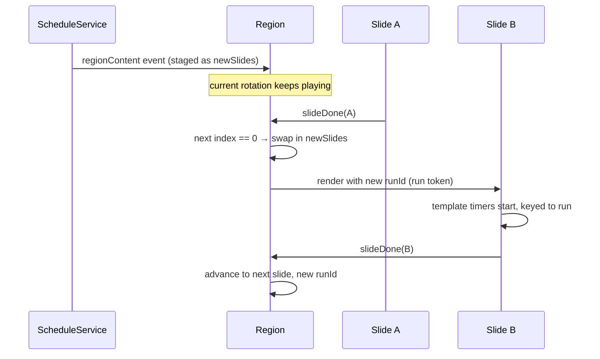
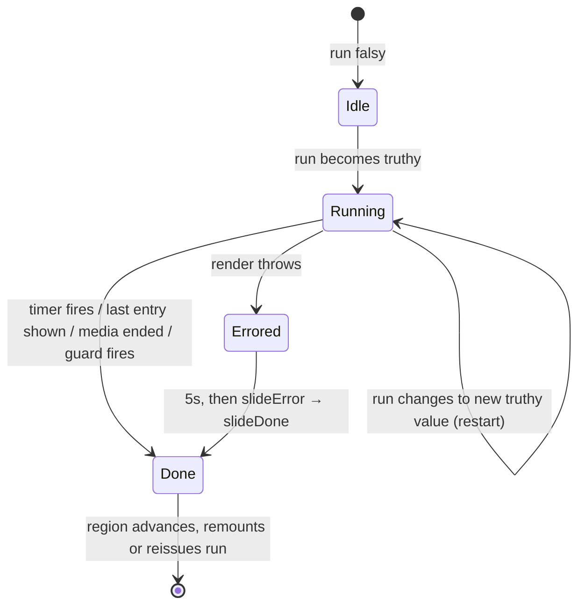

# Scheduling in the OS2display screen client

How the client decides **what** to show, **when** to show it, and **how long** each slide runs.
Written for developers who know programming but not necessarily JavaScript or React.

All paths are relative to `assets/`.

---

## 1. The big picture

Scheduling happens in three layers. Each layer only talks to its neighbour.

| Layer | Question it answers | Code |
|---|---|---|
| **Content selection** | Which slides are eligible *right now*? | `client/service/schedule-service.js`, `client/util/schedule.js`, `client/util/isPublished.js` |
| **Rotation** | Which eligible slide is on screen, and what comes next? | `client/components/region.jsx` |
| **Slide execution** | When is the current slide *done*? | `shared/slide-utils/useBaseSlideExecution.js`, `shared/slide-utils/useMultipleEntrySlideExecution.js`, template-specific logic (e.g. `video.jsx`) |



Layers communicate through **DOM events** (`document.dispatchEvent` / `addEventListener`), not direct function calls.
`ContentService` and `ScheduleService` are plain classes living outside React; the Region and Slide components are
React. Events are the bridge between the two worlds.

---

## 2. Content selection — `ScheduleService`

`ScheduleService` keeps a cache per region and answers: *given this region's playlists, which slides should be in
rotation right now?*

### How a slide becomes eligible

For each playlist in the region, in order:

1. **Playlist publish window.** `isPublished(playlist.published)` — a simple `from`/`to` timestamp check
   (`util/isPublished.js`). Missing bounds mean "unbounded" on that side.
2. **Playlist schedules (recurrence).** If the playlist has `schedules`, it is **hidden by default** and only shown
   while at least one schedule occurs *now*. Each schedule is an [RRULE](https://github.com/jkbrzt/rrule) string plus a
   duration in seconds. `ScheduleUtils.occursNow()` checks whether `now` falls inside `[occurrence, occurrence +
   duration]` for any occurrence.
3. **Slide publish window.** Same `isPublished` check, per slide.

Slides that pass all three are cloned and given an `executionId`:

```text
executionId = "EXE-ID-" + MD5(regionId + playlist["@id"] + slide["@id"])
```

The same slide can appear in several playlists or regions; the composite id keeps each appearance unique. Everything
downstream keys on `executionId`, never on the raw slide id.

### Timezone trick in `occursNow`

RRULE occurrence dates are "pretend UTC": `09:00` in the rule means `09:00` on the wall clock, whatever the local
timezone. To compare correctly, the client converts local *now* into the same pretend-UTC form (`Date.UTC(local year,
month, day, hour, …)`) before calling `rrule.between()`. Do the same in any new code that touches schedules — mixing
real and pretend UTC gives off-by-timezone bugs.

### Change detection and re-evaluation

- On every evaluation the service hashes `{ region, slides }` (SHA-256). Slides are only pushed to the Region when the
  hash **changes** — an unchanged result never interrupts what's on screen.
- A `setInterval` per region re-runs the evaluation every `schedulingInterval` ms (config, default **60000**). This is
  what makes publish windows and RRULE schedules take effect while content data itself is unchanged: time passes, the
  filter result changes, the hash changes.
- Results are pushed as a `regionContent-{regionId}` DOM event carrying a flat slide array. The service also tracks
  whether *all* regions are empty and emits `contentEmpty` / `contentNotEmpty` (the app uses this for the info screen).

  > **Known bug (issue 523).** `checkScheduling()` writes the re-evaluated list to `region.slide` while
  > `checkForEmptyContent()` reads `region.slides`, so after the first re-evaluation the empty check reads a stale list
  > and the fallback overlay stops tracking reality. Fix is a one-character rename; it is not in this branch.
- `regionRemoved` clears the interval and cache for that region.

Coarse data freshness is separate: `DataSync`/`PullStrategy` polls the API on `pullStrategyInterval` and hands new
screen data to `ContentService`, which calls `ScheduleService.updateRegion()` per region — on **every** pull, for every
region that has announced itself with `regionReady`. That last part is load-bearing, and used to be wrong:

  > `ContentService` also hashes the screen to decide whether to re-emit it for rendering. That hash is a *render*
  > signal only and must never gate region updates. It once did, and adding a slide to a playlist changes
  > `screen.relationsChecksum.regions` but **not** `.layout` — the `ScreenLayoutRegions` node stores its checksum as a
  > JSON array, which `JSON_SET` cannot write into, so the layout checksum is byte-identical across the edit. The pull
  > that fetched the new slide therefore re-fetched `regionData` while serving `layoutData` from cache *by reference*,
  > which left the `region` prop identity unchanged and `regionReady` silent. Both routes into `updateRegion` were
  > closed on the one pull that mattered, and the slide waited a whole further pull interval. `relationsChecksum` is
  > excluded from the screen hash for the same reason: it moves whenever anything anywhere below the screen changes.

The gate on `regionReady` is deliberate. Region content is delivered as a DOM event, so pushing to a region React has
not mounted yet drops the payload — and `ScheduleService` would still record the hash of what it "sent", so the
`regionReady` that follows the mount finds the content unchanged and sends nothing at all. A new region's first
delivery therefore stays on the `regionReady` path.

---

## 3. Rotation — the Region component

A **region** is one rectangle of the screen grid (`screen.jsx` renders one `Region` per layout region). The Region owns
rotation state:

- `slides` — the list currently in rotation.
- `newSlides` — the most recent list from `ScheduleService`, staged but not yet live.
- `currentSlide` — what's on screen.
- `runId` — the **run token** (see below).

### The run token (`runId`)

React re-renders components whenever anything changes; a plain boolean "run" flag can't tell a template *"start over"*
if the same slide plays twice in a row (a one-slide playlist). So the region passes a fresh value as the `run` prop
every time a slide should (re)start:

- Falsy (`null`) → don't run.
- Truthy → run; a **new** truthy value → restart, even without remount.

Templates and hooks must key their timers to *changes* of this token, never to "component appeared on screen" (mount).

The value is a counter (`nextRunId`, `assets/shared/slide-utils/next-run-id.js`), not a clock reading. A template that
calls `slideDone()` while mounting lands in the same millisecond as the run that started it, so a timestamp would
repeat, React would bail out of the state update, and the region would stop advancing — and no finer clock fixes it,
because browsers deliberately coarsen timer resolution as a fingerprinting mitigation. `nextRunId` holds no counter of
its own: it is a pure state updater, so each region derives an independent sequence from its own state.

### Advancing

The region hands each slide a `slideDone(slide)` callback. When called:

1. Find the current slide's index by `executionId`, take `(index + 1) % slides.length`.
2. **Wraparound is the swap point**: if the next index is `0` and `newSlides` is staged, the staged list replaces
   `slides` and its first slide plays. Content updates therefore never interrupt a rotation mid-cycle — they apply at
   the start of the next loop.
3. Set a fresh `runId`, but no sooner than `MIN_SLIDE_DWELL_MS` (1 s) after the current run started.

Three details that are easy to miss:

- **A slide cannot advance the region faster than the dwell floor** (`slide.jsx`). Templates may finish while mounting
  — a video slide with no playable media calls `slideDone()` synchronously from its own effect — and since a region
  replays a slide by handing it a new run id, an unguarded advance is an unbounded
  `effect → slideDone → new run id → effect` loop. `Slide` defers such a `slideDone` to the remainder of the floor
  instead of passing it straight through, and accepts only the first signal of each run — repeats are dropped whether
  they arrive while a deferred advance is pending or after the floor has passed. The floor is where the 1 s cross-fade
  below comes from (`region.jsx` passes `MIN_SLIDE_DWELL_MS` to the `CSSTransition`), so a transition can always finish
  before the next advance. It is measured with `performance.now()`, which is monotonic — a wall-clock step on a screen
  that has been up for weeks must not make a slide advance instantly or hang.

  `Slide` records the start of a run *during render*, not in an effect. React runs a child's effects before its
  parent's within a phase, so a template that finishes from its own layout effect would signal before a layout effect
  in `Slide` could stamp the run start, and the first advance would escape the floor. No shipped template does this
  (`video.jsx` uses a passive effect), which is why it is pinned by
  `assets/tests/client/region-layout-effect-finish.test.jsx`.

- **A staged list goes live immediately when nothing is playing** (`region.jsx`: `if (newSlides !== null &&
  !currentSlide)`). Wraparound is the swap point only while a rotation is actually running; on first load, or when an
  empty region gains content, the new list starts at once.
- **Slides marked `invalid` are dropped** as the region receives them (a slide whose template data failed to load), so a
  region's rotation can be shorter than the list `ScheduleService` sent.

Visual handoff between slides uses a CSS transition (1s crossfade); the outgoing and incoming slide briefly coexist.
This depends on `Slide` attaching the ref the region hands it — when that was missing, the transition classes were
silently never applied.



### Errors

`Slide` wraps the template in a React **ErrorBoundary** (a component that catches exceptions thrown during rendering).
On a crash it waits 5 s, then calls `slideError`, which stamps `errorTimestamp` on the slide (forcing a reload next time
it comes around) and calls `slideDone` so the playlist keeps moving. A broken template must never freeze the screen.

---

## 4. Slide execution — the `slideDone` contract

**This is the single most important rule:** every template must eventually call `slideDone(slide)` exactly once per run.
A template that never calls it **locks the playlist** on every screen it loads on. A template that calls it twice skips
a slide.

Two shared hooks in `shared/slide-utils/` implement the contract. (A React *hook* is a reusable function called inside a
component; these hooks own timers and clean them up automatically when the component leaves the screen.)

### `useBaseSlideExecution` — fixed-duration slides

```jsx
useBaseSlideExecution({ slide, run, slideDone, duration }); // duration in ms
```

Starts one timer when `run` becomes truthy (or changes to a new truthy value); calls `slideDone(slide)` when it fires;
cancels it on unmount. Invalid or missing `duration` (not a positive finite number) falls back to **15000 ms** — a
misconfigured slide holds 15 s rather than flashing past.

### `useMultipleEntrySlideExecution` — cycle-then-done slides

For templates that step through a list (RSS items, feed posts, slideshow images) before finishing:

```jsx
const { currentEntry, entryIndex, entryDuration } = useMultipleEntrySlideExecution({
  entries, run, slide, slideDone, entryDuration, // entryDuration in ms per entry
  emptyEntriesDuration,                          // optional, ms; default 1000
});
```

Shows each entry for `entryDuration`, then calls `slideDone(slide)` after the last one. Same 15 s fallback per entry.

Three rules for consumers:

- **`currentEntry` and `entryIndex` are `null` until the slide runs.** Guard on `null`; don't treat "not started" as
  index 0. Anchoring your own timers to mount instead of to `run` is the recurring bug here.
- **Empty `entries` finishes the slide** after `emptyEntriesDuration`, and cycling starts by itself if entries arrive
  later. The hook owns this so a template cannot lock the playlist by forgetting a fallback timer.
- **Derive your own animation clocks from the returned `entryDuration`**, not from the raw prop. The returned value is
  clamped; computing a fade timer from an unusable raw duration puts the two clocks out of step (a `duration` of `0`
  gives a negative fade delay that fires at once while the hook holds the entry for 15 s).

### Self-managed templates

`video.jsx` manages its own progression because "done" means "the video ended", not "N ms passed". It layers guards so
no path skips `slideDone`: `ended` and `error` events, a 30 s guard for a source that never reports a usable duration,
and a duration-based guard (video length × 1.1 + 5 s) once metadata arrives. If autoplay is rejected (browsers do this
for unmuted video), the slide shows controls and lets the guards progress the playlist. Copy this belt-and-braces
approach for any event-driven template.



---

## 5. Principles

1. **The playlist must always advance.** Every code path — success, empty data, media stall, render crash — ends in
   exactly one `slideDone` (or `slideError`) per run. Fallback timers and guards exist for this; keep them when
   refactoring.
2. **Time is keyed to `run`, not to mount.** The run token is the only restart signal. Timers, animations, and entry
   counters start when `run` changes to a new truthy value.
3. **Selection is re-evaluated, not event-driven.** Publish windows and RRULEs take effect because `ScheduleService`
   re-checks every `schedulingInterval`; there is no "publish at 09:00" push. Worst-case latency for a schedule boundary
   is one interval (default 60 s).
4. **Content swaps happen at the loop boundary.** New slide lists are staged and applied at wraparound, never mid-slide.
5. **Change detection by hash.** Identical evaluation results are never re-sent; slides on screen aren't disturbed by
   no-op updates.
6. **Layers stay decoupled via events.** Services don't import React components and vice versa; they meet at DOM events
   keyed by region id.
7. **`executionId` is the identity.** Region + playlist + slide. Use it for lookups, keys, and logging; the raw slide id
   is not unique on screen.
8. **Fail soft with fixed floors.** Invalid durations become 15 s; broken slides advance after 5 s; empty feeds skip
   after a short wait. Prefer a slow screen to a stuck one.

---

## 6. Requirements

Config (client config, loaded via `client-config-loader.js`):

- `schedulingInterval` — ms between schedule re-evaluations per region. Default 60000. Lower = tighter schedule
  boundaries, more CPU on low-end kiosks (Pi 4).
- `pullStrategyInterval` — ms between API polls for fresh screen data.

Data the scheduler expects per region:

- Playlists with `published { from, to }` (ISO datetimes or null) and `schedules[] { rrule, duration }` (RRULE string;
  duration in **seconds**).
- Each playlist with `slidesData[]`, each slide with its own `published`.
- RRULE times authored as wall-clock times ("pretend UTC" convention above).

Every template must:

- Export `{ id, config, renderSlide }` as default.
- Accept `(slide, run, slideDone)` via `renderSlide` and honor the run-token semantics.
- Call `slideDone(slide)` exactly once per run, on every path.
- Read durations from `slide.content` in **ms** for the hooks (some feed configs store seconds — convert at the template
  boundary).

## 7. Checklists

### Writing or converting a template

- [ ] Fixed duration → `useBaseSlideExecution`; cycles entries → `useMultipleEntrySlideExecution`;
      media/interaction-driven → own logic **with guards** (see `video.jsx`).
- [ ] No timer keyed to mount; everything anchored to `run`.
- [ ] `entryIndex === null` guarded — never assumed to be 0.
- [ ] `emptyEntriesDuration` set if the 1 s default doesn't suit the template (the hook handles the empty case; no
      hand-rolled fallback timer needed).
- [ ] Animation clocks derived from the `entryDuration` the hook returns, not from the raw prop.
- [ ] Duration units converted to ms before reaching a hook.
- [ ] Every `setTimeout`/`setInterval` cleared in the effect's cleanup function.
- [ ] Verified on a **one-slide playlist**: the slide replays when `run` changes without a remount.
- [ ] Verified the slide advances on a real screen (a stuck slide = locked playlist).

### Debugging "screen is stuck / wrong content"

- [ ] Slide never advances → search the template for `slideDone`; if it's only in the signature, that's the bug.
- [ ] Slide flickers or churns instead of holding → the template is finishing while mounting (empty media, empty feed,
      a duration of ~0). The dwell floor caps this at one advance per second rather than a render loop, but the
      template is still wrong: it should hold for a readable moment, not signal done immediately.
- [ ] Playlist not showing → check publish window first, then whether `schedules` exist (schedules make the playlist
      hidden-by-default) and whether an occurrence covers *now* under the pretend-UTC convention.
- [ ] Schedule changes late → expected up to `schedulingInterval` (60 s default) after the boundary.
- [ ] New content not appearing → it applies at rotation wraparound, not immediately; also check the region hash
      actually changed (client logs `sendSlides regionContent-…` on the same pull that logs
      `Fetching regions and slides for regions.`). If the pull fetched it but no `sendSlides` followed, the delivery
      path is broken, not the rotation.
- [ ] Content stuck one edit behind, indefinitely → a pull that fell back on earlier data must not cache the server's
      fresh `relationsChecksum` for it, or every later pull takes the cache branch. `PullStrategy` stores `null` for
      those keys instead; look for `Could not load …` warnings in the pull that preceded the freeze.
- [ ] Same slide behaving oddly in two regions → confirm code keys on `executionId`, not slide id.

## 8. Service components (reference)

| Component | Kind | Responsibility |
|---|---|---|
| `DataSync` / `PullStrategy` (`client/data-sync/`) | class | Poll the API, emit `content` events with screen data |
| `ContentService` (`client/service/content-service.js`) | class | Bridge sync → scheduling; feed regions to `ScheduleService`; handle `regionReady`/`regionRemoved` |
| `ScheduleService` (`client/service/schedule-service.js`) | class | Filter slides (publish + RRULE), hash-diff, per-region interval, emit `regionContent-{id}` and empty-content events |
| `ScheduleUtils.occursNow` (`client/util/schedule.js`) | function | RRULE occurrence check with pretend-UTC handling |
| `isPublished` (`client/util/isPublished.js`) | function | `from`/`to` window check |
| `Screen` (`client/components/screen.jsx`) | React | Layout grid → one `Region` per layout region |
| `Region` (`client/components/region.jsx`) | React | Rotation state, run token, `slideDone`/`slideError`, staged content swap |
| `Slide` (`client/components/slide.jsx`) | React | ErrorBoundary wrapper; calls the template's `renderSlide` |
| `useBaseSlideExecution` (`shared/slide-utils/`) | hook | Fixed-duration `slideDone` timer |
| `useMultipleEntrySlideExecution` (`shared/slide-utils/`) | hook | Entry cycling, then `slideDone` |
| Templates (`shared/templates/*.jsx`) | modules | Render content; fulfil the `slideDone` contract |
